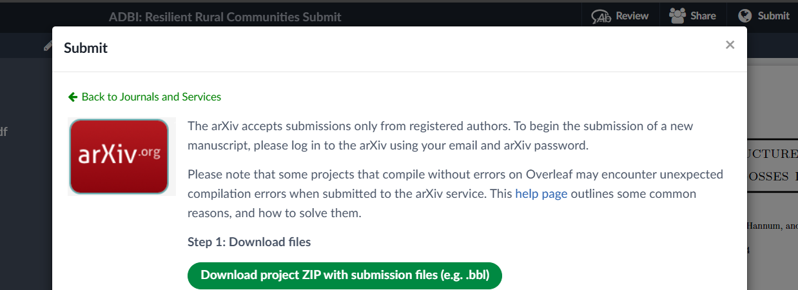
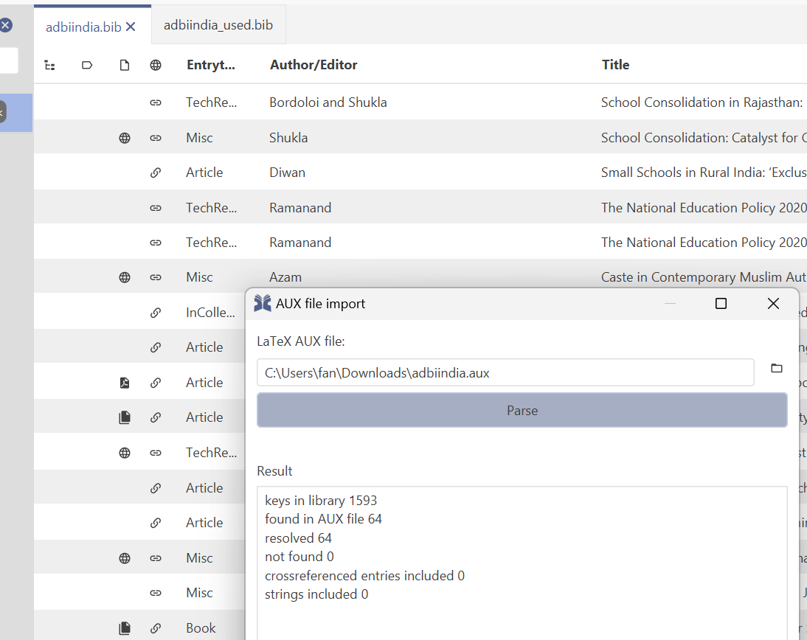
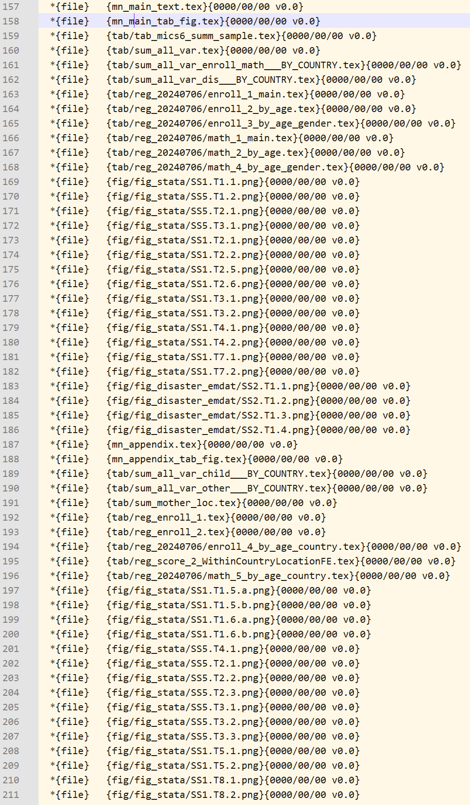
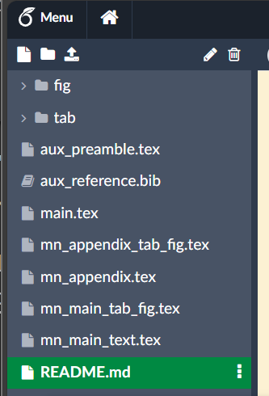

# Submit a latex project to journal

## Simple file structure

If one is working on overleaf and the project has a simple project without excessive files, then follow the process to submit to arxiv: [Download Project Zip with submission files (e.g., bbl)](https://www.overleaf.com/learn/how-to/Exporting_your_work_from_Overleaf). The process allows one to download a zip file that can be sent to any journal directly.

See the link image to download submission zip:

## Project with unused files

A latex-based project with associated files (e.g., tex, images, pdfs) has been developed. During the development process:

- A lot of images and tables were added to the project, but only a subset is used in the final file
- A lot of references were added, but only a subset is used in the final file
- A lot of tex components were created, but only a subset is used in the final file

We want to provide a "cleaned" up version of the project, in a zipped file, to share with journal, excluding extraneous information. The process has the following steps:

1. Duplicate all files to new project (copy project on overleaf), to make sure original project is protected, rename project with the same title as before, but with the "_Submit" suffix.
2. Clean up references, creating a new bib file with only references used in the project (Follow steps below)
3. Clean up sourced images and tables, delete images, pdfs, tex-tables etc unused by project (Follow steps below)
4. Clean root tex file, alternative `documentclass` files should be deleted, single root tex file for compilation (Follow steps below)

### Clean up references, bib file of only used references

To generate a smaller bib file that only includes entries that are cited. we do the following:

1. Compile current latex file and find the `.aux` file ([download in overleaf](https://www.overleaf.com/learn/how-to/View_generated_files)).
2. Download also the full bib file used to compile the paper, note that this is the file that contains potentially a lot of unused entries.
3. In [JabRef](https://www.jabref.org/), Ctrl + O, "bfw_full.bib"
4. In JabRef, Tools, New sub-library based on AUX file, browse, "bfw_output.aux"
    - Click Parse
    - See if there are any references that are "not found" in the "Result" pane after Parse, and check original document
    - Click Generate
5. Save newly opened untitled bib file with new bib title and use as paper bib file.

The submission document should include importantly the ".bbl" file, if you are working inside overleaf, you can find the bbl file here: [View generated files](https://www.overleaf.com/learn/how-to/View_generated_files).

If working inside overleaf, one could download the ".bbl" file as a part of the zip file by following the arxiv upload/download/submit instruction as well: [Download Project Zip with submission files (e.g., bbl)](https://www.overleaf.com/learn/how-to/Exporting_your_work_from_Overleaf)

See example JabRef sub-library parsing:

### Clean up extraneous images, tex component files

1. In the main document, put `\RequirePackage[dep]{snapshot}` before `\documentclass[11pt,a4paper]{article}`
2. Recompile document and find the `.dep` file ([download in overleaf](https://www.overleaf.com/learn/how-to/View_generated_files)).
3. Review all images, pdfs, and tex files that are referenced in the `.dep` file, delete files not in the list from overleaf directories.
4. Go through file and delete in tex file commented out blocks

See example dep file contents:

### Reduced file hierarchy and extraneous comments

Simplify overall file structure, so that:

1. Gateway tex file at root referencing and cominging all documents: `main`.tex
2. Four `mn*.tex` files, `mn_main_text.tex` for main text, `mn_main_tab_fig.tex` for main text figures and tables, `mn_appendix.tex` for appendix, and `mn_appendix_tab_fig.tex` for appendix figures and tables.
3. A single reference file: `aux_reference.bib` at the root
4. A single preamble file: `aux_preamble.tex` at the root
5. A single folder for images ideally without subdirectories: `fig`
6. A single folder for tex-table ideally without subdirectories: `tab`
7. A `README.md` file

See example file structure:

